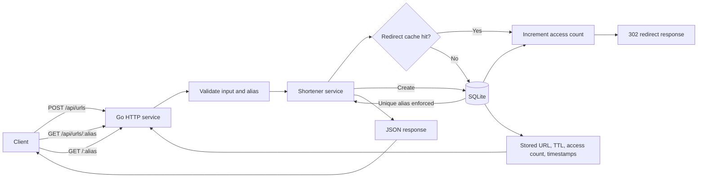

# Architecture

## Request lifecycle

- Create requests validate the URL and optional alias/TTL, then insert into SQLite.
- SQLite enforces alias uniqueness, which makes simultaneous custom-alias requests deterministic.
- Redirects check the in-memory cache first. On miss, the service loads from SQLite, verifies TTL, increments access count, then redirects.
- Metadata reads load the record from SQLite and also enforce TTL.
